# Ask O11y × Semantica：分析前 ontology / knowledge graph 語義治理研究

> **查核日：2026-08-13**
> **程式碼快照：** `main` 的 [`1ee3f2f214cc1d3ac923e1d3d86cf19a4056b66c`](https://github.com/semantica-agi/semantica/commit/1ee3f2f214cc1d3ac923e1d3d86cf19a4056b66c)（以下程式實作結論均以此為準）。
> **已發布版本：** [`v0.6.5`](https://github.com/semantica-agi/semantica/releases/tag/v0.6.5)，tag 指向 `5b319560…`；不可把 `main` 的行為自動當成 PyPI release 的已驗證行為。
> **研究問題：** Ask O11y 能否、及應如何利用 Semantica 的 ontology / KG 能力，在 ML、統計或財務分析前更準確掌握資料結構與業務語義，並交給 deterministic Analysis MCP？

## 結論

**可以借鑑並局部試驗，但不應把 Semantica 直接放進 Ask O11y 的 query-time 資料存取路徑，也不應把自動生成 ontology 當成 domain truth。**

推薦採用 **「現有 catalog / metrics metadata + 版本化薄 semantic contract + SHACL / deterministic policy gate」**（選項 C），而不是直接採用整套 Semantica。原因是：

1. Semantica 確有可用的 RDF/OWL 序列化、SHACL runtime、provenance、圖/三元組 store 與部分 schema introspection；但實作不是一個現成的資料語義層。其所謂「semantic layer」示例是 notebook 中自行撰寫的 mapping dict，而非 `semantica.semantic_layer` API。[E9]
2. `OntologyGenerator` 從**呼叫者提供的** `entities` / `relationships`、出現次數與 Python 值型別推斷 class/property；它不知道某欄位的業務意義、metric 定義、unit、grain、time semantics、合法 join 或 target leakage 規則。[E10]
3. `LLMOntologyGenerator` 是對文字呼叫 provider 的 structured generation，輸出只標為 `metadata.source = "llm"`；因此只能產生待審核 hypothesis，不能變成可執行的業務規則。[E11]
4. 其真正的 SHACL runtime 是 `pyshacl`，值得作為 PoC 比較對象；但 `OntologyValidator.validate()` 本身明確仍是 placeholder，沒有實作 HermiT/Pellet consistency/satisfiability，`check_constraint()` 直接回傳 `True`。不可把它的 `consistent=True` 視為 ontology 或業務規則已被證明。[E12]
5. Ask O11y 的資料源執行邊界必須維持 Grafana。Semantica 的 DB/Snowflake/Databricks connector 即使能取 metadata 或資料，也**不得**由 Ask O11y runtime 使用來繞過 Grafana；最多作為資料平台擁有者離線產出的、可稽核 schema snapshot 輸入。[E6][E7][E8]

因此，Ask O11y 應把 ontology/KG 的價值收斂為：**在 plan 前提供可追溯、經 steward 核准且有界的語義上下文；在 query 前阻止錯 join、錯 grain/unit、錯時間語義與 leakage；在 Analysis MCP 前交付一份固定且可驗證的 dataset contract。** 這是小型語義治理閘門，不是 Palantir clone。

---

## 身份、授權、版本與維護狀態

### 身份核實

| 檢查 | 一手證據 | 結論 |
| --- | --- | --- |
| canonical repo | GitHub repository object 的 immutable id 為 `1008304614`、`full_name` 為 `semantica-agi/semantica`、clone URL 亦為新組織。[GitHub REST](https://api.github.com/repositories/1008304614) | 使用 `https://github.com/semantica-agi/semantica` 作為 canonical source。 |
| 舊 Hawksight-AI URL | 對舊路徑的 [GitHub REST endpoint](https://api.github.com/repos/Hawksight-AI/semantica) 解析後回傳同一個 repo object（id `1008304614`，新 `full_name`）；舊 web URL 亦為 [https://github.com/Hawksight-AI/semantica](https://github.com/Hawksight-AI/semantica)。 | 這是 repo redirect / rename alias，不是另一個待比較的 fork。 |
| package metadata | [`pyproject.toml`](https://github.com/semantica-agi/semantica/blob/1ee3f2f214cc1d3ac923e1d3d86cf19a4056b66c/pyproject.toml) 的 `Repository`、`Bug Tracker` 均指向 `semantica-agi/semantica`；PyPI metadata 的 `project_urls.Repository` 同樣指向新 URL。[PyPI JSON](https://pypi.org/pypi/semantica/json) | GitHub 與發行套件的 source identity 一致。 |
| 歷史名稱殘留 | [`LICENSE`](https://github.com/semantica-agi/semantica/blob/1ee3f2f214cc1d3ac923e1d3d86cf19a4056b66c/LICENSE#L1-L3) 的 copyright 為 `Hawksight AI`；[manual Snowflake notebook](https://github.com/semantica-agi/semantica/blob/1ee3f2f214cc1d3ac923e1d3d86cf19a4056b66c/cookbook/advanced/13_Manual_Ontology_Snowflake_Mapping.ipynb) 的 Colab URL 仍含 Hawksight-AI。 | 這些是歷史命名，**不構成**可證明的公司/商標/法律承繼關係。採購或法務若需確認權利主體，必須另查。 |

### 授權與 runtime footprint

- `pyproject.toml` 和 LICENSE 都宣告 **MIT**；LICENSE 同時含通常的「AS IS / no warranty」條款。[`pyproject.toml`](https://github.com/semantica-agi/semantica/blob/1ee3f2f214cc1d3ac923e1d3d86cf19a4056b66c/pyproject.toml)[`LICENSE`](https://github.com/semantica-agi/semantica/blob/1ee3f2f214cc1d3ac923e1d3d86cf19a4056b66c/LICENSE)
- package source/metadata 是 **0.6.5**，要求 **Python >=3.8**，classifiers 列到 3.12。[`pyproject.toml`](https://github.com/semantica-agi/semantica/blob/1ee3f2f214cc1d3ac923e1d3d86cf19a4056b66c/pyproject.toml)[`semantica/__init__.py`](https://github.com/semantica-agi/semantica/blob/1ee3f2f214cc1d3ac923e1d3d86cf19a4056b66c/semantica/__init__.py#L10-L12)
- 這不是輕量 ontology-only dependency。core direct dependencies 約 **42 個**，已含 `pandas`, `scikit-learn`, `spacy`, `transformers`, `torch`, `sentence-transformers`, `rdflib`, `faiss-cpu`, `onnxruntime`, `opencv-python` 等；SHACL、Snowflake、Databricks、Oxigraph 另有 optional extras。[`pyproject.toml` dependencies / extras](https://github.com/semantica-agi/semantica/blob/1ee3f2f214cc1d3ac923e1d3d86cf19a4056b66c/pyproject.toml)
- 維護訊號是正面的但不是穩定性保證：`v0.6.5` 於 2026-08-11 發佈，main 在翌日仍有已驗證 commit；release note 同時記載大量 security/correctness 修正。[release](https://github.com/semantica-agi/semantica/releases/tag/v0.6.5)[main commit](https://api.github.com/repos/semantica-agi/semantica/commits/1ee3f2f214cc1d3ac923e1d3d86cf19a4056b66c) 這表示活躍，不表示可不經 pin/lock、SBOM、漏洞掃描與 live smoke test 就上 production。

---

## Primary-source evidence table

| ID | 已核實的 claim | 一手來源 | 對 Ask O11y 的含意 |
| --- | --- | --- | --- |
| E1 | canonical repo 是 `semantica-agi/semantica`；舊 Hawksight-AI path 解析到同一 repo id。 | [canonical REST object](https://api.github.com/repositories/1008304614) · [legacy path](https://api.github.com/repos/Hawksight-AI/semantica) | 固定新 URL / immutable SHA；不要把舊 URL 當成不同產品。 |
| E2 | package 為 MIT、0.6.5、Python >=3.8；LICENSE copyright 字串仍為 Hawksight AI。 | [`pyproject.toml`](https://github.com/semantica-agi/semantica/blob/1ee3f2f214cc1d3ac923e1d3d86cf19a4056b66c/pyproject.toml) · [`LICENSE`](https://github.com/semantica-agi/semantica/blob/1ee3f2f214cc1d3ac923e1d3d86cf19a4056b66c/LICENSE) · [PyPI JSON](https://pypi.org/pypi/semantica/json) | MIT 只回答本 package；仍需 transitive SBOM/license review。 |
| E3 | current main 與 released tag 不同；0.6.5 是近期 security release。 | [tag/release](https://github.com/semantica-agi/semantica/releases/tag/v0.6.5) · [main SHA](https://github.com/semantica-agi/semantica/commit/1ee3f2f214cc1d3ac923e1d3d86cf19a4056b66c) | PoC 固定 tag/commit、lock transitive deps；不要 `pip install` 不加版本。 |
| E4 | core install 很重；SHACL/db/triplestore 只是 additional optional extras，並非拆成 minimal ontology base。 | [`pyproject.toml` core + optional dependencies](https://github.com/semantica-agi/semantica/blob/1ee3f2f214cc1d3ac923e1d3d86cf19a4056b66c/pyproject.toml) | 不宜僅為 semantic contract 而把整包塞入 Analysis MCP image。 |
| E5 | `GraphBuilder.build()` 的正式輸入是 text、預先抽取物件、或含 `entities`/`relationships` 的 dict；它是將輸入組圖，並非 SQL catalog-to-KG mapper。 | [`graph_builder.py`](https://github.com/semantica-agi/semantica/blob/1ee3f2f214cc1d3ac923e1d3d86cf19a4056b66c/semantica/kg/graph_builder.py#L329-L548) | discovery snapshot 必須由 adapter 映射成 explicit table/column/relation entities；不能期待自動產生可靠 joins。 |
| E6 | generic `DBIngestor` 的 `export_schema()` 透過 SQLAlchemy inspector 取得 tables/columns/PK/index/views/FK。 | [`db_ingestor.py`](https://github.com/semantica-agi/semantica/blob/1ee3f2f214cc1d3ac923e1d3d86cf19a4056b66c/semantica/ingest/db_ingestor.py#L395-L488) | 可以作離線 metadata inventory 的參考；禁止讓 Ask O11y runtime 用它直連資料源。 |
| E7 | `SnowflakeIngestor.get_table_schema()` 查 `INFORMATION_SCHEMA.COLUMNS` 與 `PRIMARY KEY`，回傳 columns + `primary_keys`；該函式沒有查 FK。測試是 mock，不是 live Snowflake proof。 | [source](https://github.com/semantica-agi/semantica/blob/1ee3f2f214cc1d3ac923e1d3d86cf19a4056b66c/semantica/ingest/snowflake_ingestor.py#L683-L765) · [mock-based tests](https://github.com/semantica-agi/semantica/blob/1ee3f2f214cc1d3ac923e1d3d86cf19a4056b66c/tests/test_snowflake_ingestor.py) | Snowflake FK/join completeness不可假定；需 catalog/DDL/steward evidence。 |
| E8 | `DatabricksIngestor` 可取得 Unity Catalog columns/comments、catalog/schema/table list 與 table/column lineage，但程式建立 `primary_keys = []` 後直接回傳，沒有 FK/constraint discovery。 | [source](https://github.com/semantica-agi/semantica/blob/1ee3f2f214cc1d3ac923e1d3d86cf19a4056b66c/semantica/ingest/databricks_ingestor.py#L700-L858) · [mock-based tests](https://github.com/semantica-agi/semantica/blob/1ee3f2f214cc1d3ac923e1d3d86cf19a4056b66c/tests/test_databricks_ingestor.py) | lineage 可是 relation evidence，不能被誤當 PK/FK 或安全 join proof。 |
| E9 | verified SHA 沒有 `semantica/semantic_layer` package（[contents API 404](https://api.github.com/repos/semantica-agi/semantica/contents/semantica/semantic_layer?ref=1ee3f2f214cc1d3ac923e1d3d86cf19a4056b66c)）；semantic-layer notebook 自己寫 `create_mappings()` 與 dict。 | [notebook](https://github.com/semantica-agi/semantica/blob/1ee3f2f214cc1d3ac923e1d3d86cf19a4056b66c/cookbook/advanced/09_Semantic_Layer_Construction.ipynb) | 不把 demo 說成 shipping semantic-layer product/API。 |
| E10 | ontology generation 從 input `entities`/`relationships` 開始；class 依 type frequency（default min 2）與 common attributes，property 依 supplied relations / values 推斷。 | [`ontology_generator.py`](https://github.com/semantica-agi/semantica/blob/1ee3f2f214cc1d3ac923e1d3d86cf19a4056b66c/semantica/ontology/ontology_generator.py#L99-L335) · [`class_inferrer.py`](https://github.com/semantica-agi/semantica/blob/1ee3f2f214cc1d3ac923e1d3d86cf19a4056b66c/semantica/ontology/class_inferrer.py#L90-L250) · [`property_generator.py`](https://github.com/semantica-agi/semantica/blob/1ee3f2f214cc1d3ac923e1d3d86cf19a4056b66c/semantica/ontology/property_generator.py#L80-L310) | observation-derived candidate，不是 metric/business semantics。 |
| E11 | LLM ontology generation 實際呼叫 `provider.generate_structured(...)`，並把輸出標記為 `metadata: {source: "llm"}`；內建 finance template 只有 Account/Transaction/Bank/Customer 和兩個關係。 | [`llm_generator.py`](https://github.com/semantica-agi/semantica/blob/1ee3f2f214cc1d3ac923e1d3d86cf19a4056b66c/semantica/ontology/llm_generator.py) · [`domain_ontologies.py`](https://github.com/semantica-agi/semantica/blob/1ee3f2f214cc1d3ac923e1d3d86cf19a4056b66c/semantica/ontology/domain_ontologies.py) | LLM output、finance template 都必須由 domain steward 審核；不可自動授權 query/analysis。 |
| E12 | `_run_pyshacl()` 確實以 `pyshacl.validate(... inference="none")` 回傳 structured report；反之 `OntologyValidator.validate()` 明載 placeholder、reasoning checks `pass`，`check_constraint()` 固定 true。 | [runtime validator](https://github.com/semantica-agi/semantica/blob/1ee3f2f214cc1d3ac923e1d3d86cf19a4056b66c/semantica/ontology/ontology_validator.py#L217-L305) · [placeholder validator](https://github.com/semantica-agi/semantica/blob/1ee3f2f214cc1d3ac923e1d3d86cf19a4056b66c/semantica/ontology/ontology_validator.py#L260-L340) · [`OntologyEngine.validate_graph`](https://github.com/semantica-agi/semantica/blob/1ee3f2f214cc1d3ac923e1d3d86cf19a4056b66c/semantica/ontology/engine.py#L296-L386) | 用 explicit curated shapes + real SHACL report 作 gate；不信任 placeholder ontology consistency。 |
| E13 | `ProvenanceManager()` 沒有 storage path 時使用 InMemoryStorage；給 storage path 才用 SQLite，並可追蹤 source/activity/agent/checksum/version/derivation。 | [`manager.py`](https://github.com/semantica-agi/semantica/blob/1ee3f2f214cc1d3ac923e1d3d86cf19a4056b66c/semantica/provenance/manager.py#L48-L185) · [`track_entity`](https://github.com/semantica-agi/semantica/blob/1ee3f2f214cc1d3ac923e1d3d86cf19a4056b66c/semantica/provenance/manager.py#L250-L390) · [schema](https://github.com/semantica-agi/semantica/blob/1ee3f2f214cc1d3ac923e1d3d86cf19a4056b66c/semantica/provenance/schemas.py) | provenance 必須每個 boundary 顯式寫入且指定 durable storage；hash chain 不是簽章/獨立 trust anchor。 |
| E14 | TripletStore 是 RDF store abstraction（Blazegraph/Jena/RDF4J/Anzo/Oxigraph）；GraphStore 提供 Cypher CRUD/query；Triplet QueryEngine 的 basic validator 將 `INSERT`、`DELETE` 也列為有效 keyword。 | [TripletStore](https://github.com/semantica-agi/semantica/blob/1ee3f2f214cc1d3ac923e1d3d86cf19a4056b66c/semantica/triplet_store/triplet_store.py) · [SPARQL QueryEngine](https://github.com/semantica-agi/semantica/blob/1ee3f2f214cc1d3ac923e1d3d86cf19a4056b66c/semantica/triplet_store/query_engine.py) · [GraphStore](https://github.com/semantica-agi/semantica/blob/1ee3f2f214cc1d3ac923e1d3d86cf19a4056b66c/semantica/graph_store/graph_store.py) | 不要把 raw graph query endpoint 暴露給 LLM；需要只讀、allowlisted semantic-context adapter。 |
| E15 | built-in `semantica-mcp` 有 extract/decision/graph mutation/reasoning 工具，沒有 `get_table_schema`、ontology snapshot 或 contract-validation tool，且未設定 path 時圖是 in-memory。 | [server source](https://github.com/semantica-agi/semantica/blob/1ee3f2f214cc1d3ac923e1d3d86cf19a4056b66c/semantica/mcp_server/__init__.py) · [official in-repo MCP docs](https://github.com/semantica-agi/semantica/blob/1ee3f2f214cc1d3ac923e1d3d86cf19a4056b66c/docs/reference/mcp_server.md) | 不直接註冊它成 Ask O11y 的 semantic contract MCP。 |
| E16 | SHACL 是 RDF graph + shapes graph 的 validation/report vocabulary；PROV-O 是 Entity/Activity/Agent 等 provenance vocabulary；LinkML 官方 docs 可由一份 YAML model 產 JSON Schema / SHACL，但 SHACL generator 標示 Beta。 | [W3C SHACL § Validation Report](https://w3c.github.io/data-shapes/shacl/#validation-report) · [W3C PROV-O](https://www.w3.org/TR/prov-o/) · [W3C OWL 2 Overview](https://www.w3.org/TR/owl2-overview/) · [LinkML overview](https://linkml.io/linkml/intro/overview.html) · [LinkML JSON Schema](https://linkml.io/linkml/generators/json-schema.html) · [LinkML SHACL](https://linkml.io/linkml/generators/shacl.html) | standards 可作 interoperability/validation substrate；不等於自動取得商業知識。 |

---

## 真實能力與限制（不要把 demo 當 production capability）

### 1. SQL schema、PK/FK、join 的實情

| 路徑 | 已核實能取得 | 未能由實作證明 / 明確限制 | 對本案的判定 |
| --- | --- | --- | --- |
| Generic `DBIngestor` | SQLAlchemy inspector 的 tables、columns、PK、indexes、views、FK。[E6] | 不會把 schema 自動變成 ontology / canonical metric / approved join；`pyproject` 亦沒有把 SQLAlchemy 列為宣告 dependency，需在真實 install 驗證。 | 可作**離線 catalog snapshot job**候選，不可由 Ask O11y runtime 用 connection string 直連。 |
| `SnowflakeIngestor` | `INFORMATION_SCHEMA.COLUMNS`，以及僅限 `PRIMARY KEY` 的 constraint query。[E7] | `get_table_schema()` 不回傳 foreign keys、join cardinality、business meaning、unit/grain。manual notebook 的「rows only/no introspection」是該 notebook workflow 的說明，與目前 source 的 schema method 不一致，因此 source code 優先。 | PK 可作 observed evidence；FK 與 joins 必須另由 DDL/catalog/steward 補齊。 |
| `DatabricksIngestor` | Unity Catalog table columns/comments、catalog/schema/table list、table/column lineage。[E8] | `primary_keys` 被初始化為空 list；無 FK/constraint discovery。lineage 是依賴/血緣，不是 join uniqueness 或 cardinality proof。 | 可把 lineage 納入 evidence/provenance，不可推導安全 join。 |
| `GraphBuilder` / ontology engine | 接收你已整理的 entities、relationships、text。[E5][E10] | 沒有 datasource schema scan、PK/FK-to-ontology mapper、join planner。 | 需要一個明確的 discovery-to-semantic-registry adapter。 |

**答案：Semantica 不是「只能從使用者 entities/documents 建圖」——generic DB 路徑確有 PK/FK introspection，Snowflake 有 columns/PK，Databricks 有 columns/lineage。可是它也不是一個原生的、安全 SQL semantic layer：沒有通用的 schema→canonical ontology→approved joins 自動鏈路，且各 connector coverage 不一致。**

尤其不應將「欄名相同」、「Databricks lineage 有連線」或「LLM 建議」提升為 FK / join truth。每條 relation 都需要證據等級：

- `observed_constraint`：DB/warehouse 显式 PK/FK、unique constraint；
- `observed_profile`：資料 profile/uniqueness/null-rate 的時間戳證據；
- `curated_business_relation`：steward 核准的衍生 relation，例如 currency + business-date FX lookup；
- `proposed`：LLM/name-similarity 推測，只能出現在 review UI，不能進 executable plan。

### 2. ontology/KG construction 與 ontology generation

`GraphBuilder` 的關鍵 API 是 `build(sources, second_arg=None, **options)`；source 可為 `{entities, relationships}` 或 text。raw text default 使用 local ML/pattern extraction，若顯式選 `llm` 才會走 LLM。[E5] 這可用於文件中的 glossary/definition candidate extraction，但不是資料庫關係發現的替代品。

`OntologyGenerator.generate_ontology(data)` 的 stage 1 直接讀取 `data.get("entities", [])` 與 `data.get("relationships", [])`。[E10] `ClassInferrer` 按 entity type 分組，default `min_occurrences=2` 才建立 class；common property 是至少出現在 50% entity 的 key。`PropertyGenerator` 依**已提供的** relationship type 建 object property，並以 Python 值判定 `xsd:integer` / `xsd:double` / date / string。[E10]

所以它能產生：

- 觀察到的 class/property name、基本型別、某些 domain/range candidate；
- 提供給 RDF/OWL/SHACL authoring 的初稿；
- 顯式 supplied relation 的 KG 表示；
- n-ary / temporal association 的模型工具（`AssociativeClassBuilder`）。[associative class source](https://github.com/semantica-agi/semantica/blob/1ee3f2f214cc1d3ac923e1d3d86cf19a4056b66c/semantica/ontology/associative_class.py)

它**不能由上述 heuristic 證明**：

- `revenue` 是 gross/net/recognized/cash-basis 哪一種；
- `amount` 的 ISO currency、scale、是否可跨幣別相加；
- row 的 entity grain / time grain；
- event time、as-of time、accounting period、timezone；
- feature 是否在 target prediction 時可見；
- FK 缺失時哪個同名欄位是合法 join；
- business assumption 是否已被所有者核准。

### 3. domain know-how：三種事實必須分開

| 類型 | 可由何處來 | 能否自動成為 policy | 正確處置 |
| --- | --- | ---: | --- |
| **Observation-derived structure** | information schema、DDL、catalog、data profile、lineage、已存在 data dictionary | 否 | 保留 source snapshot、擷取時間、connector/permission、confidence。 |
| **Curated domain rule** | metric owner、finance controller、engineering SME、資料 steward 的版本化審核 | 是，但只在 approval/effective date 後 | canonical IDs、definition、unit、grain、join policy、time/leakage constraint 必須此處來。 |
| **LLM-generated hypothesis** | Semantica `LLMOntologyGenerator`、Ask O11y LLM、文件 extraction | 否 | 標記 `proposed`，帶 prompt/model/source evidence，交 steward approve/reject；絕不自動 query。 |

內建 `finance` template 只有 Account、Transaction、Bank、Customer 與 `hasAccount` / `belongsTo`，沒有 metric、currency、unit、period 或 accounting policy。[E11] 它不能取代財務 domain model。

### 4. SHACL、OWL、reasoning、provenance、store/query 的適當角色

**SHACL。** W3C SHACL 的輸入是 data graph + shapes graph，輸出是含 `sh:conforms` / `sh:result` 的 validation report。[W3C SHACL](https://w3c.github.io/data-shapes/shacl/#validation-report) Semantica 的 `_run_pyshacl()` 真的呼叫 pySHACL，且 `OntologyEngine.validate_graph()` 可接受 RDF string 或 `rdflib.Graph`。[E12] 這可驗證「已宣告」的 datatype、cardinality、allowed values、pattern、closed shape 等結構約束。

但這個 source code 將 pySHACL inference 設為 `none`，而自動 shape 只會從提供的 ontology property（例如 `required`、`cardinality`、`one_of`、`pattern`）生成。因此：

- 自動從現有資料觀察到的 shape 不會神奇得知「目前完全缺席的欄位其實必填」；官方 in-repo guide 也明說需顯式注入 constraint。[Semantica SHACL guide](https://github.com/semantica-agi/semantica/blob/1ee3f2f214cc1d3ac923e1d3d86cf19a4056b66c/docs/guides/shacl-validation.md)
- SHACL conformance 只表示 data 對**該版本 shapes**符合；不表示 shape 或業務規則本身正確。
- Ask O11y 要把 shape validation 與 deterministic `join/grain/unit/as-of/leakage` validator 並列，不能只跑 SHACL。

**OWL / logical validation。** `OWLGenerator` 能把 ontology dict 用 rdflib（或 fallback string formatting）序列化為 Turtle/RDF/XML/JSON-LD/N3。[`owl_generator.py`](https://github.com/semantica-agi/semantica/blob/1ee3f2f214cc1d3ac923e1d3d86cf19a4056b66c/semantica/ontology/owl_generator.py) 這不等於有一個已運作的 OWL DL reasoner。`OntologyValidator` 的 implementation 明確是 placeholder，故 production gate 必須排除它。[E12]

**Reasoning。** `Reasoner` 是可用的字串 fact/rule forward chaining（default `max_iterations=50`），`DatalogReasoner` 有 finite-fact semi-naive fixpoint。[`reasoner.py`](https://github.com/semantica-agi/semantica/blob/1ee3f2f214cc1d3ac923e1d3d86cf19a4056b66c/semantica/reasoning/reasoner.py)[`datalog_reasoner.py`](https://github.com/semantica-agi/semantica/blob/1ee3f2f214cc1d3ac923e1d3d86cf19a4056b66c/semantica/reasoning/datalog_reasoner.py) 它們可在 sandbox 試驗 steward-approved rule，例如「feature event time 必須小於等於 as-of」。但 `SPARQLReasoner.execute_query()` 在有 triplet store 時的註解就是「For now, return empty result」，`_has_type()` 也固定 true；不可作 query-time semantic enforcement。[`sparql_reasoner.py`](https://github.com/semantica-agi/semantica/blob/1ee3f2f214cc1d3ac923e1d3d86cf19a4056b66c/semantica/reasoning/sparql_reasoner.py)

**Provenance。** PROV-O 提供 Entity/Activity/Agent/derivation 的 interoperable vocabulary。[W3C PROV-O](https://www.w3.org/TR/prov-o/) Semantica 的 `ProvenanceManager` 可作為 PoC 比較材料，能 export PROV RDF、記 source/agent/activity/versions/bundles/hash chain；但它預設是 in-memory，且記錄必須由呼叫者顯式呼叫 `track_*`。[E13] Ask O11y 不可假設「用了 Semantica 就自動有完整 lineage」。每個 boundary 必須主動記錄 snapshot、approval、query、normalized dataset、analysis artifact。

**Stores/query。** `TripletStore` / Oxigraph 可存 ontology/KG 並跑 SPARQL；`GraphStore` 支援 CRUD/Cypher。[E14] 它們是 semantic metadata store，不是 Grafana datasource execution boundary。更重要的是，TripletStore query validator 的 accepted keywords 包含 `INSERT`、`DELETE`，GraphStore 也暴露 CRUD/Cypher；都不是天然 capability-safe、read-only LLM context API。[E14]

**Semantica MCP。** 內建 MCP 有 mutable `add_entity`、`add_relationship`、`record_decision`，但缺資料表 schema discovery、ontology snapshot retrieval、contract validation tool；預設 graph 也可能是 process-memory。[E15] 因此不建議直接掛到 Ask O11y LLM。

---

## 推薦架構：bounded semantic context，不繞過 Grafana

### 不可違反的 boundary

1. **Grafana Query MCP 是唯一 datasource execution boundary。** Semantica、semantic registry、Query Planner、Analysis MCP 都沒有 DB/Snowflake/Databricks credentials，也不得持有能執行 datasource query 的 endpoint。
2. **Query Planner 只產生 plan，不執行 query。** Ask O11y LLM 依已註冊 MCP schemas/capabilities 動態選擇流程，但對任何實際 query 都必須先 preview/confirm。
3. **Engineering / Finance Analysis MCP 是 deterministic。** 內部不放 LLM、skill runtime 或自由文字推論；它只接受 validated normalized dataset contract，輸出受控 PNG artifact、摘要與 provenance。
4. **Renderer 是唯一 Grafana write boundary，且 approval-gated。** 使用 Analysis MCP 時只綁定受控 PNG，不把任意 analysis JSON 猜成 Grafana 原生 chart。
5. **Semantica（若試用）只在離線 authoring/sandbox。** 可協助 RDF/SHACL/PROV 的 prototype；不得有 Grafana datasource credentials、不得在 user query 時直連 warehouse。

```mermaid
flowchart LR
  subgraph Discovery[離線／受控 metadata discovery]
    C[Existing catalog / approved metadata export\n或 Grafana-approved metadata boundary]
    S[Physical schema snapshot\ntables, columns, PK/FK, lineage, profile evidence\nsource + hash + captured_at]
    C --> S
  end

  subgraph Governance[版本化 semantic registry]
    M[Steward-curated mapping\ncanonical entity/metric IDs\nunits, grain, time, joins, constraints]
    V[SHACL + JSON Schema\n+ deterministic policy validator]
    P[PROV-style provenance records\nsnapshot / approval / change]
    S --> M
    M --> V
    M --> P
  end

  subgraph Planning[Ask O11y dynamic MCP planning]
    L[Ask O11y LLM]
    SC[Read-only bounded Semantic Context\nresolver: selected IDs + constraints only]
    QP[Query Planner MCP\nplan only]
    Preview[Plan preview\njoins, metrics, grain/unit/time\nassumptions + risk gates]
    Approve{User approves?}
    M --> SC
    V --> SC
    L --> SC
    SC --> QP
    L --> QP
    QP --> Preview --> Approve
  end

  subgraph Execution[Execution after approval]
    GQ[Grafana Query MCP\nONLY datasource execution]
    N[Deterministic normalizer\nvalidated normalized dataset contract]
    AM[Engineering / Finance Analysis MCP\ndeterministic; no LLM]
    PNG[Controlled PNG artifact\nsummary + provenance]
    R[Approval-gated Grafana Renderer]
    Approve -- approved immutable plan --> GQ --> N --> AM --> PNG --> R
  end

  Approve -- rejected / semantic failure --> Stop[Fail closed:\nno Grafana query, no Analysis MCP]
  V --> Stop

  Optional[Optional Semantica sandbox\nOWL/SHACL/PROV/triplestore authoring\nNO datasource credentials] -. exports reviewed artifacts only .-> M
```



### 最小可行資料流

1. **Schema/table relationship discovery**：資料平台以既有 catalog 或 Grafana-approved metadata boundary 產 `physical_schema_snapshot`；收集 explicit PK/FK、columns、comments、lineage、profile evidence。若 Grafana 沒有足夠 metadata API，使用 catalog export，而不是讓 Semantica runtime 直連 datasource。
2. **Curated ontology mapping**：steward 把 physical identifiers 映射到 stable canonical entity/attribute/metric IDs；每個 mapping 帶 owner、approval、evidence、effective range、version。
3. **Semantic validation**：JSON Schema/LinkML class model 驗 contract shape；SHACL 驗 RDF representation；deterministic validator 驗 relation evidence、cardinality、unit conversion、grain roll-up、as-of/leakage。任一 required failure 即停止。
4. **Bounded ontology context**：只投影本次 intent 涉及的 canonical IDs、最多必要的 join path、metric definition、unit/grain/time/leakage gates、assumption/provenance IDs；不送全圖、不送 raw table dump、不送 credentials。
5. **Plan preview**：LLM/Query Planner 只能引用 canonical IDs 和 approved relation IDs，輸出 human-readable preview；使用者確認前不得執行。
6. **Grafana query**：確認後由 Grafana Query MCP 執行 immutable approved plan；result 帶 query execution ID/hash/time range。
7. **Normalized dataset contract**：normalizer 比對 query result 的 columns/type/row count/missingness/units/grain 與 snapshot/plan，產受控 artifact reference + digest。
8. **Analysis MCP**：只接受這份 contract；若 metadata 與 dataset 不符、缺 approval、target leakage 或 provenance 缺失，直接拒絕。成功時只產 controlled PNG artifact（可附 summary/provenance）。

### 為何 bounded context 比「把整個 ontology 丟進 prompt」好

- 減少 prompt token、避免已廢止或無關 mapping 影響 plan；
- 可測試：相同 intent + snapshot + registry version 應投影出相同 context；
- 可授權：只投影 caller 有權看到的 metric/entity；
- 可稽核：每個 plan 只引用有限的 immutable IDs、shapes、assumption IDs；
- LLM 不需要也不應自行解釋 RDF/SPARQL 或猜 join。

---

## Analysis MCP 的最小 contract

下列不是 Semantica 現有的 public API；這是 Ask O11y 應自行擁有、可 JSON Schema / SHACL 驗證的 boundary contract。語義欄位使用 canonical IDs，physical columns 只作 audited mapping，不作 LLM 自由選擇的 authority。

### 必填欄位清單

| 群組 | 最小欄位 | 用途 |
| --- | --- | --- |
| 身份/版本 | `contract_version`, `contract_id`, `semantic_snapshot.id/version/sha256`, `policy_bundle.id/version/sha256` | 防止 schema/ontology drift。 |
| physical provenance | `schema_snapshot_id`, `datasource_ref`, `grafana_query_execution_id`, `approved_plan_id`, `query_hash`, `time_range` | 證明資料從唯一 datasource boundary 而來。 |
| canonical semantics | `entities[]`, `attributes[]`, `metrics[]` 的 canonical IDs、definition/version、physical mapping | 分離 business identity 與 table/column name。 |
| relationship / join | `join_path[]`：approved relation ID、left/right key、join type、cardinality、evidence kind、fanout policy | 阻止名稱相似但錯的 join。 |
| grain / time / unit | `dataset_grain`, `metric.grain`, `units`, `time_semantics`, `timezone`, `as_of` | 阻止錯 aggregation、混幣別、未定義 observation window。 |
| analysis eligibility | `target`, `features[]` 的 `eligible_at_as_of`、`feature/target` roles、forbidden fields | 阻止 target leakage。 |
| quality | `missingness`, `row_count`, `schema_fingerprint`, `validation`（SHACL + policy results） | 讓 deterministic MCP fail closed。 |
| transformations | `allowed_transformations[]`（只列已審核 ID/parameter bound） | 不讓 MCP 任意 transform data。 |
| assumptions | `assumptions[]`：ID、文字、owner、status、effective period | 讓分析結論可追溯至明確假設。 |
| artifact integrity | `dataset_artifact.uri`, `sha256`, `format`, `content_schema` | 防止 analysis 接到掉包或未驗證資料。 |

### 範例（縮減版）

```json
{
  "contract_version": "1.0",
  "contract_id": "analysis-contract:8a6f",
  "approved_plan_id": "plan:4e15",
  "semantic_snapshot": {
    "id": "ask-o11y-ontology",
    "version": "2026-08-13.1",
    "sha256": "sha256:...",
    "status": "approved"
  },
  "schema_snapshot_id": "schema:ops-finance:2026-08-13T00:00:00Z",
  "source_provenance": {
    "datasource_ref": "grafana-datasource:approved-ops-finance",
    "grafana_query_execution_id": "gq:92f1",
    "query_hash": "sha256:...",
    "time_range": {"from": "2026-01-01T00:00:00Z", "to": "2026-06-30T23:59:59Z"}
  },
  "dataset": {
    "artifact": {
      "uri": "artifact://normalized/92f1.parquet",
      "format": "parquet",
      "sha256": "sha256:...",
      "content_schema": "normalized-dataset/v1"
    },
    "schema_fingerprint": "sha256:...",
    "row_count": 18234,
    "grain": {
      "canonical_id": "grain.work_order_as_of_day",
      "keys": ["entity.work_order", "time.as_of_date"],
      "one_row_per": "work order x as-of date"
    },
    "time_semantics": {
      "event_time": "attribute.work_order.opened_at",
      "as_of_time": "attribute.work_order.as_of_at",
      "timezone": "UTC",
      "feature_cutoff": "attribute.work_order.as_of_at",
      "inclusion": "feature.event_time <= feature_cutoff"
    }
  },
  "entities": [
    {
      "canonical_id": "entity.work_order",
      "physical_table": "ops.work_order",
      "primary_key": ["work_order_id"],
      "business_meaning": "maintenance work request"
    }
  ],
  "metrics": [
    {
      "canonical_id": "metric.maintenance_cost_usd",
      "definition_version": "3",
      "aggregation": "sum",
      "input": "attribute.cost_ledger.amount",
      "unit": "USD",
      "grain": "grain.work_order_as_of_day",
      "currency_conversion": "transform.fx_daily_to_usd.v1"
    }
  ],
  "join_path": [
    {
      "relation_id": "relation.work_order_has_cost_ledger.v1",
      "left": "ops.work_order.work_order_id",
      "right": "finance.cost_ledger.work_order_id",
      "join_type": "left",
      "cardinality": "1:N",
      "evidence": {"kind": "observed_fk", "schema_snapshot_id": "schema:ops-finance:2026-08-13T00:00:00Z"},
      "fanout_policy": "aggregate cost_ledger to work_order before joining"
    }
  ],
  "analysis": {
    "target": {
      "canonical_id": "target.work_order.sla_breach",
      "eligible_at_as_of": true,
      "label_available_after": "attribute.work_order.closed_at"
    },
    "features": [
      {
        "canonical_id": "feature.sensor_energy_7d_kwh",
        "eligible_at_as_of": true,
        "allowed_transformations": ["transform.sum_7d.v1"],
        "unit": "kWh"
      }
    ],
    "forbidden_fields": [
      "attribute.work_order.closed_at",
      "attribute.work_order.final_actual_cost",
      "attribute.cost_ledger.posted_after_as_of"
    ]
  },
  "quality": {
    "missingness": [{"canonical_id": "feature.sensor_energy_7d_kwh", "rate": 0.03, "policy": "impute_median_if_lte_0_05"}],
    "validation": {
      "json_schema": "pass",
      "shacl": {"conforms": true, "report_artifact": "artifact://validation/shacl-92f1.json"},
      "semantic_policy": "pass"
    }
  },
  "assumptions": [
    {"id": "assumption.fx_daily_close.v1", "status": "approved", "owner": "finance-controller"}
  ],
  "provenance": {
    "activity_id": "activity:normalize:92f1",
    "bundle_id": "bundle:analysis:8a6f",
    "ontology_snapshot_version": "2026-08-13.1"
  }
}
```

### Deterministic acceptance rules for this contract

Analysis MCP 必須拒絕以下任何一項：

- `approved_plan_id`、query execution ID、schema/ontology/policy hash 不存在或彼此不一致；
- requested canonical metric/entity/relation 不在 approved snapshot；
- join relation 不是 approved，或 cardinality/fanout policy 缺失；
- dataset grain 與 metric/target grain 不可對齊；
- unit 不同但沒有 approved conversion；
- event/as-of time、timezone、feature eligibility、forbidden fields 缺失或違反；
- missingness policy、allowed transform、assumption 未核准；
- normalized dataset hash/schema 與 contract 不符；
- SHACL 或 deterministic semantic policy 有 required violation。

拒絕時回傳 machine-readable `rejection_codes[]` 和 provenance，不呼叫 Grafana、不執行 analysis、不產 artifact。

---

## 三個選項的證據式評估

| 選項 | 能得到什麼 | 主要成本 / 證據 | 判定 |
| --- | --- | --- | --- |
| **A. 直接採 Semantica** | MIT package、KG/RDF/OWL/SHACL/PROV、stores、generic DB schema inspection。 | core dependency 很重；built-in semantic layer 不存在；built-in MCP 不符合本案 contract；validator/SPARQL reasoning 有明確 placeholder；direct connectors 會破壞 Grafana-only execution boundary。[E4][E9][E12][E14][E15] | **不推薦**做 Ask O11y production runtime dependency。 |
| **B. 只抽用部分 Semantica** | 可在隔離 PoC 試 `OntologyEngine.to_shacl/validate_graph`、`ProvenanceManager`、Oxigraph / RDF export。 | 以 pip 使用仍會帶 core dependency footprint；需自己包 stable API、access control、versioning；不能依 placeholder validator 或 direct MCP；main/tag 差異需驗證。[E3][E4][E12][E15] | **可作比較型 sandbox PoC**，不作預設架構。不要 vendor 大段 source，只因名字像 semantic layer。 |
| **C. 不採套件：LinkML/SHACL/現有 catalog + metrics metadata 的薄層** | 將組織已擁有的 source-of-truth 映射到一份小型 versioned contract；可生成 JSON Schema/SHACL，並在 planner/normalizer 加 deterministic policy。LinkML 官方支持 YAML model 到 JSON Schema / SHACL，但其 SHACL generator 標示 beta。[E16] | 需要真正安排 steward review、metric owner、metadata sync 與 contract tests；這是必要治理成本，不能由 KG 自動省略。 | **推薦。** PoC 先用一份小 YAML/JSON + hand-written deterministic checks；若後續確定需要 single-source codegen，再導入 LinkML。 |

### 最終建議

採 **C**，並在一至兩週 PoC 中加入一個小型 **B 的對照實驗**：使用 `pyshacl` 或 Semantica 的 `validate_graph()` 對同一份 curated shapes 跑 validation，確認是否有實際差異。不要先部署 Semantica graph DB、MCP server、LLM ontology generator 或 direct connector。

這也回答 README 自稱「Open Source Palantir for AI Agents」的定位：那是 upstream 自我描述（[README](https://github.com/semantica-agi/semantica/blob/1ee3f2f214cc1d3ac923e1d3d86cf19a4056b66c/README.md)），**不是**本研究對功能等價性的宣稱。Ask O11y 本案只需要一個 analysis safety/semantic contract gate；不建 object/action platform、完整 enterprise ontology workbench 或第二個 datasource plane。

---

## 1–2 週 PoC

### 範圍：五張具關係的工程/財務表

| Table | PK / grain | 關係與目的 |
| --- | --- | --- |
| `ops.asset` | `asset_id` PK；一列一資產 | 工程資產主檔；含 `site_id`（刻意作為錯 join 陷阱）。 |
| `ops.work_order` | `work_order_id` PK；一列一工單 | `asset_id` FK → asset；含 `site_id`、`opened_at`、`closed_at`、`sla_breach`。 |
| `finance.cost_ledger` | `ledger_entry_id` PK；一列一成本入帳 | `work_order_id` FK → work_order；含 `posted_at`、`amount`、`currency`、`final_actual_cost`。 |
| `ops.sensor_daily` | (`asset_id`, `observation_date`)；asset-day | `energy_kwh`，供 7-day feature；與工單非天然同 grain。 |
| `finance.fx_rate_daily` | (`currency`, `rate_date`)；currency-day | approved derived temporal lookup，將 amount 轉 USD；不是拿欄名猜出的 FK。 |

### 三個必須 fail 的情境

1. **錯 join**：計畫將 `ops.asset` 與 `ops.work_order` 用共同的 `site_id` join。`site_id` 是多對多候選而非 steward-approved path；唯一允許 path 是 `asset.asset_id → work_order.asset_id`（1:N）。預期：`JOIN_RELATION_NOT_APPROVED`，Grafana query 次數為 0。
2. **錯 grain / unit**：計畫將 asset-day `sensor_daily.energy_kwh` 直接與多列 `cost_ledger.amount` 相加，或跨 EUR/USD 直接 `SUM(amount)`。預期：`GRAIN_MISMATCH` 或 `UNIT_CONVERSION_REQUIRED`；須先依 approved window aggregate、再用 approved FX transform。
3. **target leakage**：以 `work_order.opened_at` 為 as-of 來預測 `sla_breach`，卻把 `closed_at`、`final_actual_cost` 或 as-of 後 `posted_at` 的 ledger 當 feature。預期：`LEAKAGE_AFTER_AS_OF`，不進 Analysis MCP。

### baseline 與驗收指標

**Baseline**：相同表/欄位名稱與簡短 description，但不提供 curated join、grain/unit、as-of/leakage policy 的現行/簡化 planner。記錄它對四個固定 prompts（3 個 unsafe + 1 個 safe）的 plan，不預設它一定失敗。

| 指標 | PoC acceptance target |
| --- | ---: |
| 三個 seeded unsafe plan 被 semantic gate 拒絕 | **3/3** |
| rejected plan 導致 Grafana Query MCP 呼叫 | **0** |
| safe request（work-order cost USD by month，先正確 aggregate/FX）產生 approved preview | **1/1** |
| 送入 Analysis MCP 的 dataset contracts 通過 JSON Schema + SHACL + deterministic policy | **100%** |
| contract 帶 immutable schema/ontology/policy/query/dataset hashes | **100%** |
| Analysis MCP 的同 input 可重現結果；內部 LLM/skill runtime invocation | **0** |
| reviewer 能從 preview 看見 relation、cardinality、grain、unit、time cutoff、assumptions | **100% of four cases** |

### 工作分段（約 10 個工作天）

1. **D1–D2：snapshot** — 以批准的 metadata/catal​og export 收集五表 DDL/PK/FK/comments/profile/lineage，產 hash 和 source provenance；不接 Semantica direct connector。
2. **D3–D4：curation** — 與 engineering/finance steward 定義 canonical entities、三條實體 relation、FX relation、兩個 metric、grains、units、as-of/leakage rules；建立 approval record。
3. **D5：validation artifacts** — 寫最小 JSON Schema + SHACL shapes + deterministic relation/unit/grain/leakage checks；將 3 個壞案例做固定 fixtures。
4. **D6：context + preview** — 建只讀 bounded context projection；Query Planner 只輸出 canonical-ID plan preview，加入 explicit user confirmation。
5. **D7：Grafana → normalizer** — 只在確認後呼叫 Grafana Query MCP；normalizer 產有 hash 的 dataset contract。
6. **D8：deterministic Analysis MCP** — 接 contract，對 safe query 產 controlled PNG、summary、provenance；拒絕三個不安全 case。
7. **D9：比較實驗** — 可選地以 Semantica `validate_graph()` / pySHACL 對同 shapes 做結果比對；不讓它取得 datasource credentials。
8. **D10：review** — 逐條核對 baseline、fail-closed records、Grafana audit、steward sign-off，決定是否值得引入 LinkML 或 Semantica sandbox。

### Fail-closed 行為

- snapshot 過期、來源/權限不明、schema fingerprint 漂移；
- mapping/metric/join/assumption 無 steward approval；
- 多條可行 join path 而沒有指定 approved relation；
- unit/grain/timezone/as-of 任何一項未知；
- feature 可能晚於 cutoff，或 target label semantics 未定；
- validation report 非 conforming，或 policy validation 無法判定；
- plan approval 後 query/contract/hash 改變；
- normalizer 與 query result column/type/row artifact 不符。

任一情況的唯一安全行為是：**提出修復/澄清要求或退回 preview；不執行 Grafana query、不呼叫 Analysis MCP、不寫 dashboard。**

---

## 對 scope、acceptance、validation、architecture 的影響

### Scope

- 初期只新增/採用「versioned semantic registry + bounded context resolver + contract validator」；不新增 full graph service、Semantica MCP、Semantica datasource connector 或 Palantir-style platform。
- Semantica 如試用，僅限隔離 authoring/validation benchmark，且無 datasource credentials。
- 沒有需求時不導入 LinkML；第一版可以是一份小型 YAML/JSON registry 加 JSON Schema/SHACL artifacts。

### Acceptance

- 每個 analysis request 必須有 `approved_plan_id`、semantic/schema/policy snapshot hashes、Grafana execution provenance、normalized dataset hash。
- 3/3 seeded invalid cases 必須在 query 前 fail closed；1/1 safe case 必須有可讀 preview 和受控 PNG output。
- 不含 Analysis MCP 的 request 仍可走 Grafana native panel；含 Analysis MCP 的 request 只能輸出 controlled PNG binding。

### Validation

- contract shape：JSON Schema（或將來 LinkML-generated JSON Schema）。
- graph shape：curated SHACL + real `sh:conforms` report；不要採信 Semantica placeholder `OntologyValidator`。
- semantic safety：deterministic relation/cardinality/unit/grain/time/leakage validator。
- integration safety：assert rejected case 的 Grafana call count = 0、Analysis MCP call count = 0；assert Analysis MCP 沒有 LLM/skill runtime。
- provenance：每一步記 source snapshot、steward approval、preview approval、query hash、dataset/artifact hash；必要時映射到 W3C PROV-O。

### Architecture

- Ask O11y LLM 負責 dynamic plan synthesis 和自然語言 preview，不負責建立 fact；它只能從 registered MCP schemas/capabilities 調用 read-only semantic context 與 plan tool。
- Query Planner 只 plan；Grafana Query 是唯一 read execution；Renderer 是唯一 Grafana write。
- Engineering/Finance Analysis MCP 不查 ontology、不查 datasource、不跑 LLM；它只驗 contract + 產 deterministic analysis/PNG。

---

## 風險與待核實事項

1. **Release vs main 差異**：本研究讀的是 2026-08-12 main SHA，正式採用任何 Semantica API 前，需以 `v0.6.5` wheel/tag 重跑 import、SHACL、provenance、optional-extra smoke tests。
2. **Grafana metadata discovery seam 未核實**：本研究沒有證明現有 Grafana MCP 是否提供跨 datasource 的 schema/PK/FK/catalog metadata API。若沒有，需由現有 catalog/metadata export 產 snapshot；這不是讓 Semantica 繞過 Grafana 的理由。
3. **資料來源真實 constraint coverage**：Snowflake/Databricks connector source 的 metadata coverage 不等於倉庫真的宣告/維護 FK。PoC 必須拿真實 DDL/catalog 及 profile evidence 驗證。
4. **steward ownership**：metric owner、finance controller、engineering SME、data steward 及其 approval SLA 尚未定義；沒有此治理，ontology 只是字典。
5. **安全與資料最小化**：bounded context 是否包含敏感欄位名稱、dataset artifact access、row-level policy 與 tenant isolation 需單獨 threat model。
6. **provenance durability**：若使用 Semantica `ProvenanceManager`，必須設定 durable storage；hash chain 可偵測某些斷鏈，不能取代 append-only store、signing、RBAC 或 independent audit log。[E13]
7. **LinkML generator maturity**：官方 SHACL generator 標為 Beta；若導入，固定版本並對 generated JSON Schema/SHACL 做 golden tests。[E16]
8. **法律主體**：repo redirect 可以核實 source identity，不能核實 Semantica AGI 與 Hawksight AI 的公司、商標、copyright assignment 關係；交法務確認。

---

## 完整一手來源

### Semantica / package / release

- <https://api.github.com/repositories/1008304614>
- <https://api.github.com/repos/Hawksight-AI/semantica>
- <https://github.com/semantica-agi/semantica>
- <https://github.com/semantica-agi/semantica/commit/1ee3f2f214cc1d3ac923e1d3d86cf19a4056b66c>
- <https://github.com/semantica-agi/semantica/releases/tag/v0.6.5>
- <https://github.com/semantica-agi/semantica/blob/1ee3f2f214cc1d3ac923e1d3d86cf19a4056b66c/pyproject.toml>
- <https://github.com/semantica-agi/semantica/blob/1ee3f2f214cc1d3ac923e1d3d86cf19a4056b66c/LICENSE>
- <https://pypi.org/pypi/semantica/json>

### Semantica implementation / examples / tests

- <https://github.com/semantica-agi/semantica/blob/1ee3f2f214cc1d3ac923e1d3d86cf19a4056b66c/semantica/kg/graph_builder.py>
- <https://github.com/semantica-agi/semantica/blob/1ee3f2f214cc1d3ac923e1d3d86cf19a4056b66c/semantica/ingest/db_ingestor.py>
- <https://github.com/semantica-agi/semantica/blob/1ee3f2f214cc1d3ac923e1d3d86cf19a4056b66c/semantica/ingest/snowflake_ingestor.py>
- <https://github.com/semantica-agi/semantica/blob/1ee3f2f214cc1d3ac923e1d3d86cf19a4056b66c/semantica/ingest/databricks_ingestor.py>
- <https://github.com/semantica-agi/semantica/blob/1ee3f2f214cc1d3ac923e1d3d86cf19a4056b66c/tests/test_snowflake_ingestor.py>
- <https://github.com/semantica-agi/semantica/blob/1ee3f2f214cc1d3ac923e1d3d86cf19a4056b66c/tests/test_databricks_ingestor.py>
- <https://github.com/semantica-agi/semantica/blob/1ee3f2f214cc1d3ac923e1d3d86cf19a4056b66c/cookbook/advanced/09_Semantic_Layer_Construction.ipynb>
- <https://github.com/semantica-agi/semantica/blob/1ee3f2f214cc1d3ac923e1d3d86cf19a4056b66c/cookbook/advanced/13_Manual_Ontology_Snowflake_Mapping.ipynb>
- <https://api.github.com/repos/semantica-agi/semantica/contents/semantica/semantic_layer?ref=1ee3f2f214cc1d3ac923e1d3d86cf19a4056b66c>
- <https://github.com/semantica-agi/semantica/blob/1ee3f2f214cc1d3ac923e1d3d86cf19a4056b66c/semantica/ontology/ontology_generator.py>
- <https://github.com/semantica-agi/semantica/blob/1ee3f2f214cc1d3ac923e1d3d86cf19a4056b66c/semantica/ontology/class_inferrer.py>
- <https://github.com/semantica-agi/semantica/blob/1ee3f2f214cc1d3ac923e1d3d86cf19a4056b66c/semantica/ontology/property_generator.py>
- <https://github.com/semantica-agi/semantica/blob/1ee3f2f214cc1d3ac923e1d3d86cf19a4056b66c/semantica/ontology/llm_generator.py>
- <https://github.com/semantica-agi/semantica/blob/1ee3f2f214cc1d3ac923e1d3d86cf19a4056b66c/semantica/ontology/domain_ontologies.py>
- <https://github.com/semantica-agi/semantica/blob/1ee3f2f214cc1d3ac923e1d3d86cf19a4056b66c/semantica/ontology/ontology_validator.py>
- <https://github.com/semantica-agi/semantica/blob/1ee3f2f214cc1d3ac923e1d3d86cf19a4056b66c/semantica/ontology/engine.py>
- <https://github.com/semantica-agi/semantica/blob/1ee3f2f214cc1d3ac923e1d3d86cf19a4056b66c/semantica/ontology/owl_generator.py>
- <https://github.com/semantica-agi/semantica/blob/1ee3f2f214cc1d3ac923e1d3d86cf19a4056b66c/semantica/provenance/manager.py>
- <https://github.com/semantica-agi/semantica/blob/1ee3f2f214cc1d3ac923e1d3d86cf19a4056b66c/semantica/provenance/schemas.py>
- <https://github.com/semantica-agi/semantica/blob/1ee3f2f214cc1d3ac923e1d3d86cf19a4056b66c/semantica/reasoning/reasoner.py>
- <https://github.com/semantica-agi/semantica/blob/1ee3f2f214cc1d3ac923e1d3d86cf19a4056b66c/semantica/reasoning/datalog_reasoner.py>
- <https://github.com/semantica-agi/semantica/blob/1ee3f2f214cc1d3ac923e1d3d86cf19a4056b66c/semantica/reasoning/sparql_reasoner.py>
- <https://github.com/semantica-agi/semantica/blob/1ee3f2f214cc1d3ac923e1d3d86cf19a4056b66c/semantica/triplet_store/triplet_store.py>
- <https://github.com/semantica-agi/semantica/blob/1ee3f2f214cc1d3ac923e1d3d86cf19a4056b66c/semantica/triplet_store/query_engine.py>
- <https://github.com/semantica-agi/semantica/blob/1ee3f2f214cc1d3ac923e1d3d86cf19a4056b66c/semantica/graph_store/graph_store.py>
- <https://github.com/semantica-agi/semantica/blob/1ee3f2f214cc1d3ac923e1d3d86cf19a4056b66c/semantica/mcp_server/__init__.py>
- <https://github.com/semantica-agi/semantica/blob/1ee3f2f214cc1d3ac923e1d3d86cf19a4056b66c/docs/guides/shacl-validation.md>
- <https://github.com/semantica-agi/semantica/blob/1ee3f2f214cc1d3ac923e1d3d86cf19a4056b66c/docs/reference/mcp_server.md>

### Published standards / official project docs

- <https://w3c.github.io/data-shapes/shacl/#validation-report>
- <https://www.w3.org/TR/prov-o/>
- <https://www.w3.org/TR/owl2-overview/>
- <https://linkml.io/linkml/intro/overview.html>
- <https://linkml.io/linkml/generators/json-schema.html>
- <https://linkml.io/linkml/generators/shacl.html>

## Acceptance report

```acceptance-report
{
  "criteriaSatisfied": [
    {
      "id": "criterion-1",
      "status": "satisfied",
      "evidence": "Only the authorized Markdown research artifact was written; it contains the requested primary-source analysis, architecture/dataflow, contract, options, PoC, risks, and sources."
    }
  ],
  "changedFiles": [
    ".scratch/research/ask-o11y-semantica-ontology-analysis.md"
  ],
  "testsAddedOrUpdated": [],
  "commandsRun": [
    {
      "command": "Primary-source inspection of GitHub REST metadata, immutable repository source, package metadata, release metadata, official W3C/LinkML specifications",
      "result": "passed",
      "summary": "Claims in the report are tied to official repo/API/package/standards URLs; implementation was checked at main SHA 1ee3f2f214cc1d3ac923e1d3d86cf19a4056b66c."
    },
    {
      "command": "Runtime install/import/live warehouse validation",
      "result": "not-run",
      "summary": "Research-only task; no product code or datasource credentials were used. The report specifies the required PoC smoke tests."
    }
  ],
  "validationOutput": [
    "Markdown artifact written successfully.",
    "No product source, configuration, or dependency manifest was modified.",
    "No git staging operation was performed by this task."
  ],
  "residualRisks": [
    "The authorized worker artifact is under .scratch/research rather than the user-requested docs path; a parent with repository write authority must promote it if that documentation path is required.",
    "Semantica main is newer than release v0.6.5; production behavior requires pinned-release smoke tests.",
    "Grafana's available metadata-discovery capability and real datasource constraint coverage remain to be verified in the PoC."
  ],
  "noStagedFiles": true,
  "diffSummary": "Added one research report only.",
  "reviewFindings": [
    "No scope-widening code changes.",
    "Direct adoption of Semantica as an Ask O11y runtime datasource/semantic service is not recommended pending the described PoC."
  ],
  "manualNotes": "Artifact destination follows delegated writer authority; no other files were edited."
}
```
